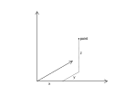
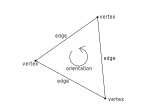
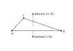
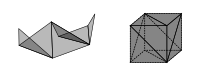

## Heroin Tesselation Library.

This is a work in progress and nothing useful could be done with the library as of now.

This library contains functions to work with triangulated meshes, representing 3d shapes.
It's intended use is for 3d printing, both for programatic modeling and slicing.

### Point

A point in 3 dimensional cartesian space.
Also used to represent a vector pointing from origin to this point.
The coordinate values are stored as integers. Unit is micrometers (10<sup>-6</sup> m). 
1 um = 0.001 mm. This is very unlike other similar libraries, that choose floating point numbers.
The main reason to choose integers is to make numerical stability easier -
the integer rounding is well defined and consistent on all platforms.



Sample code of point definition in scheme:

```scheme
(use-modules (htl htl))

(define origin (point 0 0 0))
(define a (point 1000 2000 3000))
```

And in C:

```c
#include <htl.h>

  HtlPoint a;
  a.x = 1000;
  a.y = 2000;
  a.z = 3000;
  HtlPoint origin = htl_point(0, 0, 0);
```

**Scheme procedure: point *x y z* **

  Return a new 3D point.

**Scheme procedure: point? *p* **

  Checks if *p* is a point.

**C structure HtlPoint**

```c
typedef struct
{
  int x,
  int y,
  int z
} HtlPoint;
```

  Represents 3D point. The structure is passed as an argument and returned directory,
  without pointer indirection. It could be allocated and initialized directly.

**C function: HtlPoint htl_point*(int x, int y, int z)* **

  Helper function to return a point.

**Scheme procedure: point-x *point* **

**Scheme procedure: point-y *point* **

**Scheme procedure: point-z *point* **

  Returns a coordinate of the point.

In C, access the structure fields directly.

**C function: *bool* htl_point_equal*(HtlPoint p1, HtlPoint p2)* **

  Returns if the points are equal.

In scheme, compare the points with *equal?*.

**Scheme procedure: point-add *v1 v2* **

**C function: *HtlPoint* htl_point_add*(HtlPoint v1, HtlPoint v2)* **
  
  Return addition of vectors.

### Face

Face is a triangle in 3D space. It is defined by three points called vertices.
The order of the points is significant, this is called face orientation.
The line segments between the vertices are called edges.
 


**Scheme procedure: face *a b c* **

  Return a face defined by the specified points. 
  The face is represented directly by a list of 3 points, and also could be constructred in that way:
  *(face a b c)* is equivalent to *(list a b c)*.

**Scheme procedure: face? *f* **
  
  Checks if *f* is a face.

**C structure HtlFace**

```c
typedef struct
{
  HtlPoint a,
  HtlPoint b,
  HtlPoint c
} HtlFace;
```

   Represents face. The structure is passed as an argument and returned directly too.
   It could be allocated and initialized directly.

**C function: HtlFace htl_face*(HtlPoint a, HtlPoint b, HtlPoint c)* **

  Helper function to return a face.

**Scheme procedure: face-equal *f1 f2* **

**C function: *bool* htl_face_equal*(HtlFace f1, HtlFace f2)* **

  Compare two faces for equality. 
  Orientation is respected, but the precise order of the points is ignored:

```scheme  
(face-equal (face a b c) (face b c a)) => #t
(face-equal (face a b c) (face a c b)) => #f
```

**Scheme procedure: face-point-orientation *f p* **

**C function: *int* htl_face_point_orientation*(HtlFace f, HtlPoint p)* **

  Determines if the point lies above, at or below the face plane. 
  Returns positive integer if the point lies above the face: when looking from the point at the face,
  the vertices of the face appear in counter-clockwise order. 
  Returns zero if the point lies on the face plane.
  Returns negative integer if the point lies below the face: when looking from the point,
  the vertices appear in clockwise order.
 


**Scheme procedure: lower-bound *f* **

**Schmeme procedure: higher-bound *f* **

**C function: *HtlPoint* htl_face_lower_bound*(HtlFace f)* **

**C function: *HtlPoint* htl_face_higher_bound*(HtlFace f)* **

  Returns the coordinates of the bounding box: Smallest orthogonal box containing the face.

### Surface

Surface is a set of faces. If the surface wraps around 3D space, it represents the enclosed 3d shape.
In this case we call it closed. Surfaces are stored as 6-dimensional tree, allowing quick lookup
of faces at given coordinates. The surfaces are immutable.



**Scheme procedure: surface *faces* **

**Scheme procedure: surface *face1 face2 ...* **

  Creates a surface from given faces. 
  Accepts list of faces as one arguments, or faces as multiple arguments.

**Scheme procedure: surface? *s* **

  Returns true if s is an surface

**Scheme procedure: surface-faces *s* **

  Returns a list of all faces in the surface. The order of the faces may be different from the order
  given in *surface*. For huge surface this may be time and memory expensive.
 
**C type: *typedef struct HtlSurface* HtlSurface **

  In C, the surface is represented by a pointer to anonymous structure *HtlSurface\**. 
  NULL is a valid empty surface. Surfaces are reference counted. 
  Surfaces can be constructed incrementaly with *htl_surface_add*.

**C function: *HtlSurface\** htl_surface_ref*(HtlSurface\* s)* **

  Increment the reference count of the surface. This must be reversed with call to *htl_surface_unref*.
  Returns the argument. In case *s* is *NULL*, does nothing and returns *NULL*.

**C function: *void* htl_surface_unref*(HtlSurface\* s)* **

  Decrement the reference count of the surface. When the count reaches zero, the surface is freed.
  In case *s* is *NULL*, does nothing.

**Scheme procedure: surface-equal *s1* *s2* **

**C function: *bool* htl_surface_equal*(HtlSurface\* s1, HtlSurface\* s2)* **

  Returns true if the surfaces are equal: 
  They are composed of the same faces when compared by *htl_face_equal*. 
  Time complexity is O(n log n).

**Scheme procedure: surface-add-face *s f* **

**C function: HtlSurface* htl_surface_add*(HtlSurface\* s, HtlFace f)* **

  Create a new surface by adding a face into a surface. Time complexity is O(log n).
  In C the returned surface must be freed with *htl_surface_unref*. Example of surface contruction:

```c
  HtlFace[] faces;
  int i;
  HtlSurface* surface = NULL;
  for (i = 0; i != 99; i++) {
    HtlSurface* next = htl_surface_add(surface, faces[i]);
    htl_surface_unref(surface);
    surface = next;
  }
  // Use the surface
  // ...
  htl_surface_unref(surface);
```

**C type: *typedef bool (*\*HtlFaceTraverseFunc*)(HtlFace face, void\* data)* **

  Surface Traversal function. Should return *true* to continue traversing or *false* to stop.

**C function: *bool* htl_surface_traverse_faces*(HtlSurface\* surface, HtlFaceTraverseFunc func, void\* data)* **

  Call the func for all faces in the surface. Returns *true* if all calls to *func* returned *true*.
  Returns *false* if some call to *func* returned *false* and the traversal stopped.
  Faces are traversed in an unspecified order.

**Scheme procedure: contains-face? *s f* **
  
**C function: *bool* htl_surface_contains_face*(HtlSurface\* s, HtlFace f)* **

  Returns if the surface contains a face, that is equal to *f* as compared with *htl_face_equal*.
  Time complexity is O(log n).

**Scheme procedure: lower-bound *s* **

**Scheme procedure: higher-bound *s* **

**C function: *HtlPoint* htl_surface_lower_bound*(HtlSurface f)* **

**C function: *HtlPoint* htl_surface_higher_bound*(HtlSurface f)* **

  Returns the coordinates of the bounding box: Smallest orthogonal box containing all surface.
  Time complexity is O(log n).

**Scheme procedure: faces-at *s l b* **

**C function: *bool* htl_surface_traverse_faces_at*(HtlSurface\* s, HtlPoint l, HtlPoint h, HtlTraverseFunc func, void\* data)* **

  Returns/Traveres the faces whose bounding box intersects or touches the box defined by 
  lower bound *l* and higher bound *h*. In case *l* and *h* are equal, returns/traverses the faces
  whose bounding box contains the point. 
  In case the number of returned or traversed faces is constant, the time complexity is O(log n).

## Hacking

In C files, Use 
[mozilla coding style](https://developer.mozilla.org/en-US/docs/Mozilla/Developer_guide/Coding_Style).

You can automatically format to this style with command:

    $ clang-format --style=mozilla -i <filename>

List of main source files:

- **test/test.scm** Scheme tests. This tests also cover most of C code, 
  as scheme code is mostly a wrapper to call C code.
- **test/test.c** C tests. Test C code that is not covered by scheme tests.
- **htl/htl.scm** Scheme interface.
- **src/wrapper.c** C to scheme wrapper code.
- **src/htl.h** C interface.
- **src/htl.c** C implementation.

In case of a new feature, you probably want to edit the files in this order.
